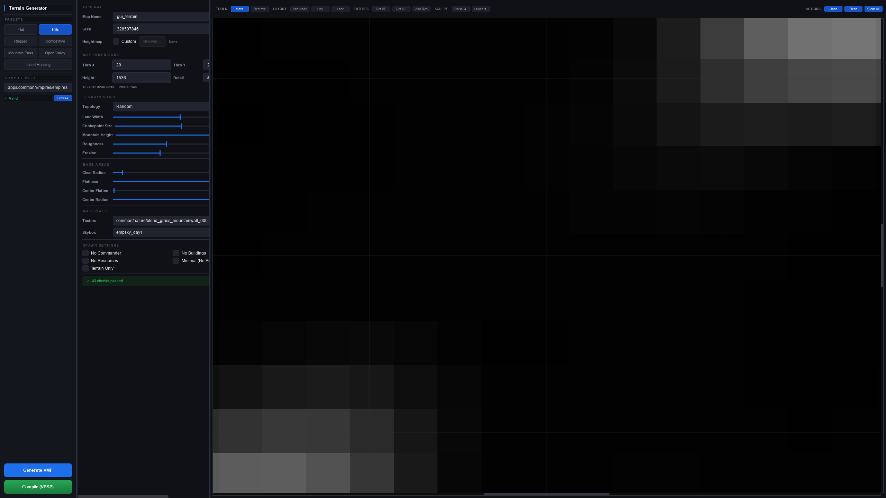

# Empires Mod Terrain Generator

An advanced **procedural terrain generator and graphical interface** designed specifically for creating compile-ready displacement maps for the Source Engine modification, **Empires Mod**.

## Quick Start (Linux/macOS)

```bash
# Download the repository
cd terrain_generator

# Run the launcher (creates venv automatically on first run)
./terrain.sh

# Or use directly from command line:
./terrain.sh --gui                    # GUI mode
./terrain.sh --cli hills --seed 123  # CLI with preset
./terrain.sh --compile               # Compile last VMF
./terrain.sh --help                  # Show all options
```

The launcher automatically:
- Creates a local virtual environment (nothing installed system-wide)
- Installs all dependencies
- Detects Proton installations for compilation
- Provides interactive menus for easy operation



## Overview

The Terrain Generator bridges the gap between procedural noise generation and the strict mapping requirements of the Source Engine. It creates organic, playable maps using multi-layered Fractal Brownian Motion (fBm) and hydraulic erosion, handling all the complex VMF (Valve Map Format) intricacies behind the scenes.

With an interactive graphical interface, map creators can generate, preview, customize, and compile competitive multiplayer maps in minutes instead of weeks.

## Main Features

*   **Interactive Live Map Preview:** Visualize the generated heightmap instantly as you tweak parameters. Changes to the noise seed, size, or ruggedness reflect in real-time.
*   **Custom Heightmaps:** You can also choose to import your own custom `png` image heightmaps to manually author the fundamental terrain shapes, skipping the procedural noise entirely.
*   **Procedural Landscape Engine:** Combines rolling hills, sharp mountain ridges, and hydraulic erosion to create natural-looking, continuous terrain grids.
*   **Drag-and-Drop Entity Placement:** Directly click and drag on the live preview to custom place the Imperial Commander Base, Northern Faction Base, and Resource Nodes exactly where you want them.
*   **Intelligent Auto-Balancing:** Built-in algorithms flatten the terrain gently at base locations to ensure builders have a level playing field, while avoiding unnatural sudden drops.
*   **Source Engine Compliance:** Generates 100% mathematically convex, correctly aligned, airtight displacement geometry designed specifically to avoid VBSP compilation errors or engine crashes.
*   **Automatic VBSP Compilation:** Automatically locates your Empires Mod installation and directly compiles the generated VMF into a playable BSP format with one click.
*   **Ready-to-Play Presets:** Select from pre-configured terrain styles like *Flat*, *Hills*, *Rugged*, or *Competitive* to get a fast start.

## How to Use

1. **Launch the Application**
   * Download the latest release from the [Releases page](https://github.com/jtg007/terrain_generator/releases).
   * Extract the ZIP file and run `TerrainGenerator.exe` (Windows) or launch via Python.

2. **Configure Your Map**
   * Pick a **Preset** on the left to set up a baseline style.
   * *Optional*: In the "Custom Image" setting, browse to load a black & white `.png` heightmap to bypass procedural generation.
   * Adjust **Tiles X** and **Tiles Y** for the map size (each tile is 512 units).
   * Slide **Roughness**, **Erosion**, and **Height Scale** to shape the terrain.
   * Choose a safe **Skybox** and **Terrain Texture**.

3. **Customize Entity Layout**
   * Beneath the map preview, select an entity tool (e.g., *Set Imp Base*, *Set NF Base*, *Add Resource*).
   * Click on the map preview to place or move the entity.
   * Choose the *Move/Drag* tool to fine-tune placements by dragging the markers.

4. **Generate and Compile**
   * Ensure your **Empires Path** is correctly selected on the left sidebar.
   * Click **Generate Safe Map** to bake your terrain and entity layout into a `.vmf` file.
   * Click **Compile (VBSP)** to convert the VMF into a playable `.bsp` map directly in your game folders.

5. **Play!**
   * Start Empires Mod.
   * Create a local server or load the map via the developer console (`map gui_terrain`).

## Local Development Requirements

If you prefer to run the code from the source instead of using the pre-compiled executable:

*   **Python 3.10+**
*   Empires Mod installed via Steam (for VBSP compiling)
*   Required packages:
    ```bash
    pip install -r config/requirements.txt
    ```

To launch the GUI from source:
```bash
python tools/terrain_generator.py
```
